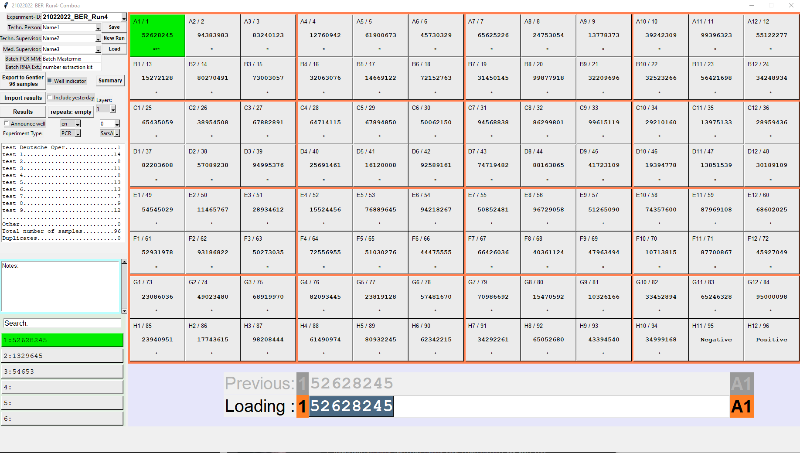
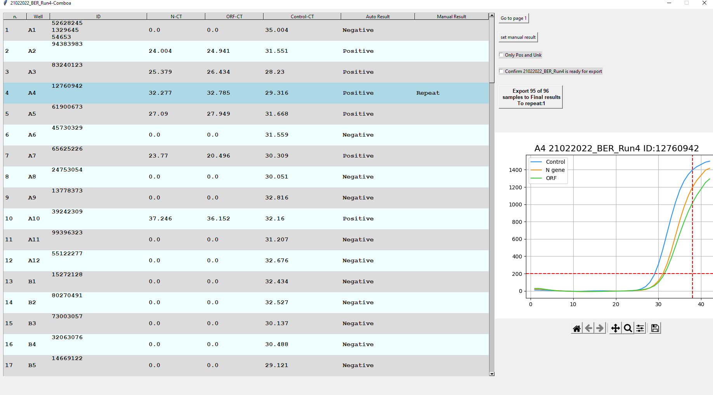

# Comboa

Comboa is a Python program with a GUI built using Tkinter, designed specifically for Windows. It was created to enhance the workflow of in diagnostic laboratories, providing a tool to streamline various aspects of  processing samples for PCR analysis.

## Screenshots

*Main screen of Comboa, with service area, wells showing ID and "*" in each well indicates number of ID's entered in that well, usefull for pooling, entry menu, and Layers area showing all the ID's entered in that well.

*Export screen of Comboa, shows ID's of the samples, and CT values. Aplification curve is presented. Automatically assigned results can be overwritten by a manual one. There is a filter to show only Positive and unknow results, Export button has a live counter on it showing the number of results that are going to be exported, and repeated.

## Key Features

- **Sample Layout and Pooling:**
  - Efficiently enter and manage samples into the 96-well layout, pooling of samples possible.

- **Integration with Gentier 96E PCR Machine's software:**
  - Export specific strings compatible with Gentier 96E PCR machine software to preserve sample ID's in the logs of the machine.
  - Import results from the PCR machine for further analysis and validation.

- **Convenient Validation and Export:**
  - Automated suggested interpretation of results, reducing the possibility of operator errors.
  - Export results based on validation outcomes, and using desired methods (CSV file, SQL upload, Gmail API or Outlook emails).
  - Display amplification curves for manual analysis and validation.
  - Highlight predefined cutoff values for easy interpretation.

- **Barcode Scanner Optimization:**
  - Streamlined sample entry with a barcode scanner, rejecting duplicates, special characters, unexpected lengths, or entries made in a short predefined time period.

- **Experiment Documentation and Saving:**
  - Save and load experiments, document each step and experiment information efficiently.
  - Save files in simple Microsoft Excel (.xlsx) format for easy examination and modification (as a backup).

- **Pooling Functionality:**
  - Register multiple PCR sample IDs to a well on a 96-well plate.
  - Automated assignment of results based on pooled samples' outcomes.

- **Automated Result Analysis:**
  - Automatically assign experiment results by comparing CT values to predefined thresholds and control requirements.
  - Handle inconclusive results or results from positive pools and manage them in a retest list for further processing.

- **Real-time Updates and Reporting:**
  - Provide real-time updates on the total number of samples and samples by prefix withing the experiment and throughout the day.
  - Maintain a repeat list and update it throughout the day for efficient sample retesting and validation.

- **Flexible Export Options:**
  - Export results in CSV format.
  - Email results automatically via Gmail API or MS Outlook with pre-filled templates and attachments.
  - Directly upload results to an SQL server.

- **Customizable GUI and Configuration:**
  - GUI based on Tkinter, packaged into a single executable file.
  - Easily configurable settings through a configuration file.
- **Many other small convenient optimizations**
  - Automatically bring up the window of Gentier program after Export of the export sting
  - Automatically storing Experiment name to the copy buffer, so that it's easy to name experiment exactly the same in Gentier program
  - Auto suggesting experiment name in the format Date_Region_ExperiemntType_Number (For example 22012023_Berlin_PCR_12) experiment number suggested automatically.

## Usage (for PCR)

1. Set up a config file, appropriate to the folder path required.
2. Launch the Comboa GUI using `Comboa.exe`.
3. Fill in experiment information, enter sample ID's.
4. Export a file to Gentier, in the Gentier program proceed with creating and completing experiment, export experiment data
5. In Comboa press Import From Gentier, and you will be taken to the validation screen where you can assign results based on the amplification curve or other data. Confirm validation.
6. Export final results.

Alternatively build a version for your specific purposes. 
ELISA and other test process is possible but not described here

## Project Origins and Development

Comboa was developed in-house with direct feedback from users, including the developer's own experiences as a user. It has been extensively used in at least 7 laboratories, successfully processing approximately a million test samples during Covid-19 pandemic.

## Contributing

I welcome contributions to enhance Comboa and make it even more efficient or just suitable for your application.

## License

Comboa is released under the [GNU General Public License (GPL)].

## Contact

For any inquiries or assistance, feel free to contact me through github.

